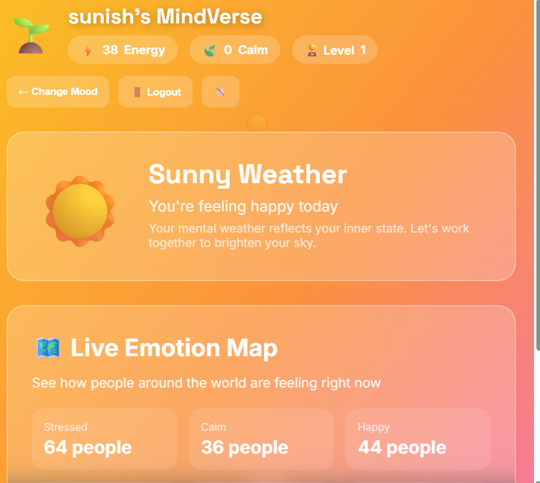
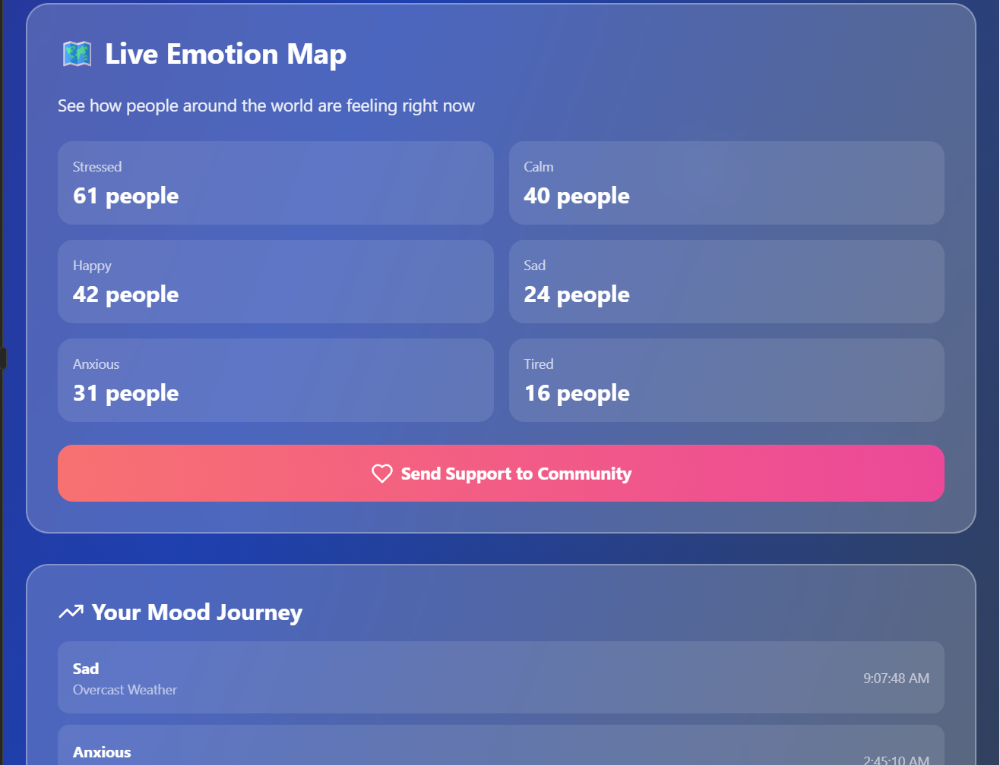
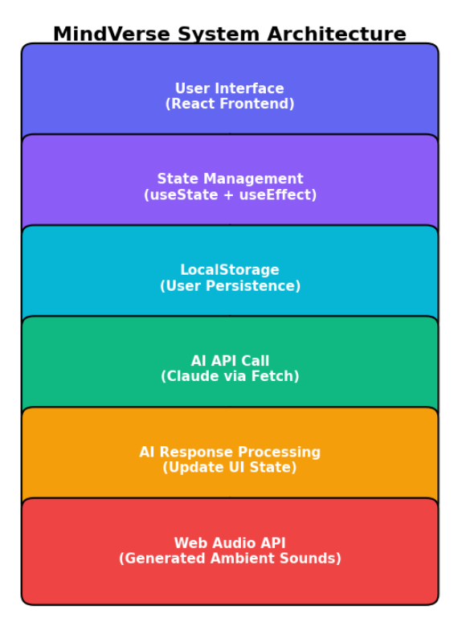
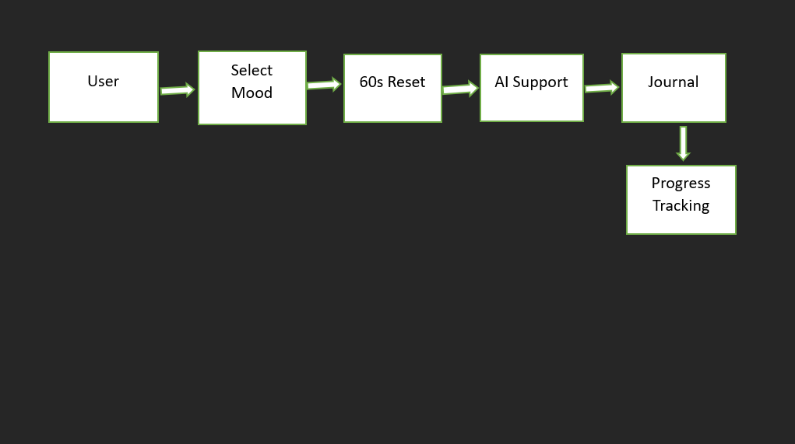

<p align="center">
  
</p>

# Mindverse 🎯

## Basic Details

### Team Name: Sunisha S

### Team Members
- Member 1: Sunisha S - NSS college of engineering Palakkd

### Hosted Project Link
https://drive.google.com/drive/folders/1DDprlg2jUMPi3-lID4qzLhg8-hKFb8WL?usp=sharing

### Project Description
MindVerse is an AI powered mental wellness web application that helps users track their mood, reduce stress through guided breathing, reframe negative thoughts using AI, and complete personalized self care tasks. It uses real time stress detection and gamification to make self-care engaging and interactive.

### The Problem statement
Talking about what feels wrong about you is hard. Self-care tools can be inaccessible or overwhelming

### The Solution
Detects stress patterns through typing behavior
Adapts the UI based on emotional state
Offers AI-powered thought reframing
Recommends personalized self-care tasks
Gamifies progress using energy and calm points
It transforms mental wellness into an engaging and accessible digital experience.

---

## Technical Details

### Technologies/Components Used

**For Software:**
- Languages used:JavaScript
- Frameworks used:React.js
- Libraries used:Lucide React (icons),Web Audio    API,Fetch API (for AI integration)
- Tools used:Node.js,npm,Git & GitHub,Vercel / Netlify (for deployment),LocalStorage (for client-side persistence)

## Features

List the key features of your project:
✅ AI Thought Reframing (Claude API integration)
🌦 Dynamic Mood-Based Weather Themes
🎵 Web Audio API Generated Calming Sounds
😮‍💨 Guided Breathing Reset Flow
🎯 AI-Powered Personalized Task Recommendation
📊 Mood History Tracking
📝 Journaling System
🎮 Gamification (Energy Points, Calm Points, Levels, Plant Growth)
🌍 Live Emotion Map (Simulated global mood statistics)
💖 Community Support Messaging System
🔍 Real-Time Stress Detection (Typing speed analysis)

---

## Implementation

### For Software:

#### Installation
```bash
npm install
```

#### Run
```bash
npm start
```

## Project Documentation

### For Software:

#### Screenshots (Add at leas





#### Diagrams

**System Architecture:**



**Application Workflow:**



---

## Team Contributions

Solo

Full frontend development
AI integration
Gamification logic
UI/UX design
Deployment

## AI Tools Used (chatgpt,claude ai)
Purpose:
AI-generated supportive responses
Personalized task messaging
Code structuring assistance

**Percentage of AI-generated code:** 25%
---

Made with ❤️ at TinkerHub


